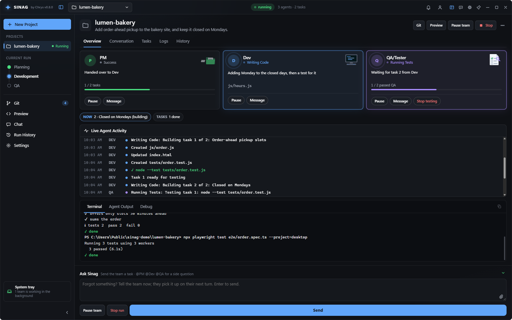
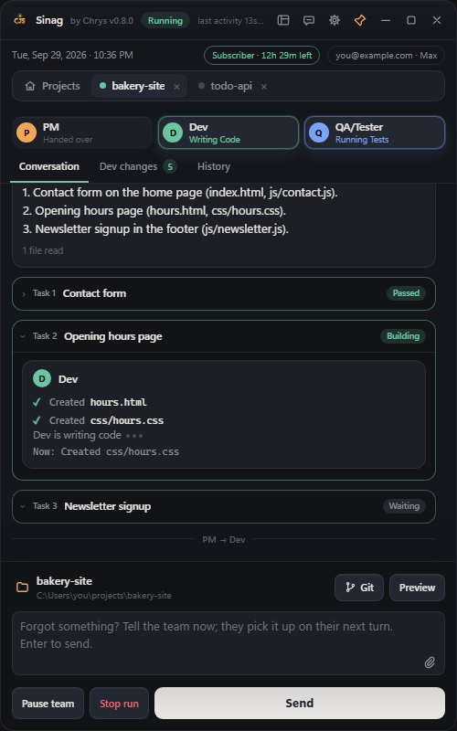
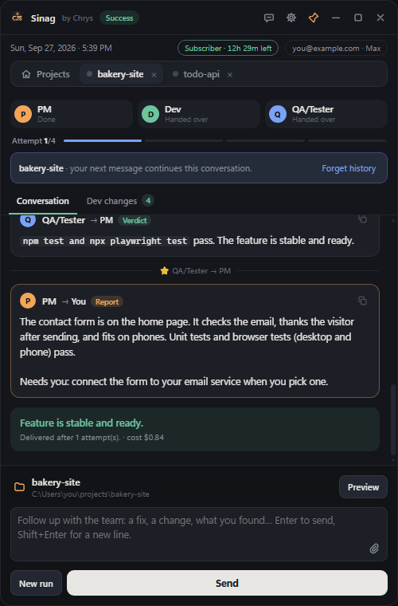
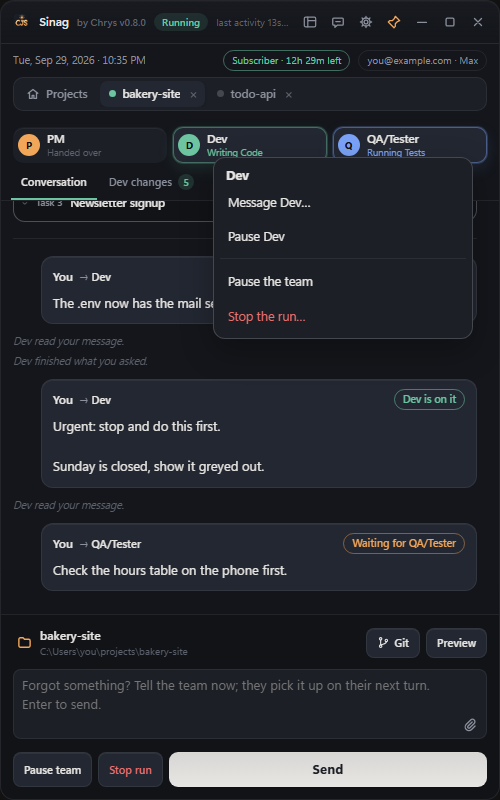
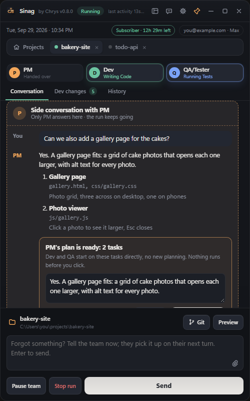
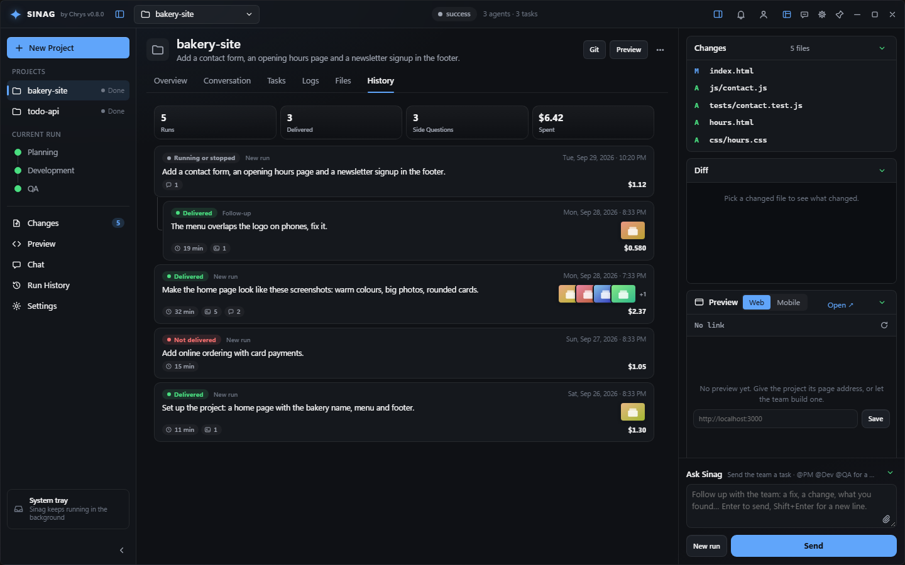
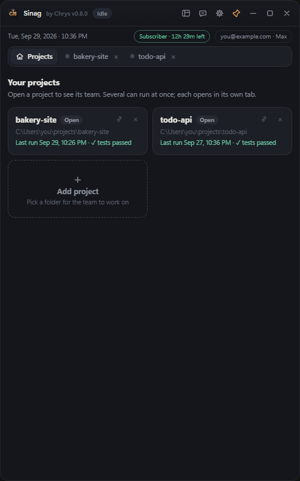
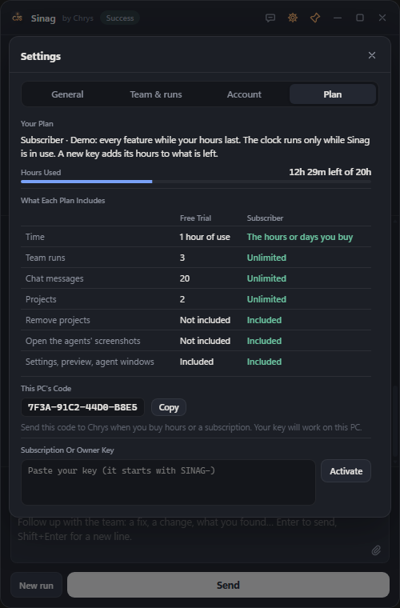

# Sinag, by Chrys

**A small floating window that turns Claude Code into a three-person software team** — a
Project Manager, a Developer and a Tester — working on your own project, on your own PC.

*Sinag* is Tagalog for "ray of light".

## Download

Get **`sinag-installer.exe`** from the [latest release](https://github.com/chrysanly/sinag-agents/releases/latest)
and run it. It installs for your Windows account only (no admin needed), and Sinag keeps itself
up to date from this page afterwards.

## How it works

  

1. **Add a project folder** and describe what you want, in plain words. Paste screenshots if they help.
2. **You and the PM talk it through.** The PM checks your project, tells you whether it can be done
   and what each agent would do, and asks whether QA should test it. What you agree is written down
   and shown on the plan, which waits for your **Begin**.
3. **The developer** builds the tasks one by one while **QA** tests each finished task (and checks
   pages on desktop and phone). Each agent says what it is doing at least once a minute. They are
   called **Ray** (PM), **Tala** (developer) and **Liwanag** (QA); rename them in
   **Settings → Team & runs**.
4. **You get a report** from whoever worked last: what was done, what was verified and what wasn't,
   what needs you, and a screenshot of the result. Add another task to the same run from the box
   under it, or start a new run.

  
  &nbsp;
  

**Steer the team while it works.** Right-click an agent to message it, pause it or stop the
testing. Every message shows whether it is waiting, being worked on or done. Type **@Ray**,
**@Tala** or **@Liwanag** (or **@PM**, **@Dev**, **@QA**) for a side conversation that never stops
the run.

  
  &nbsp;
  

**Every run, kept.** History lists each run with its result, cost, screenshots and side
questions, and reopens any of them.

  

  
  &nbsp;
  

*Screenshots of Sinag 0.8.0 with a demo project and made-up data.*

## Requirements

| What | Details |
|---|---|
| **Windows 10 or 11, 64-bit** | Installs for your account only, no admin rights. About 50 MB. |
| **A Claude account** | A Claude Pro, Max, Team or Enterprise subscription, or an Anthropic Console account (API billing). The agents run on your account, so usage counts against it; each run has a spend limit you set. |
| **Claude Code** | The first-start setup checks for it and installs it with Anthropic's official installer if it's missing, then signs you in. |
| **Internet** | To reach Claude, and for Sinag's updates. |
| **Node.js** *(web projects only)* | For QA's browser tests and their replay. Playwright is added to the project the first time, and you're asked before it installs. |

Everything else ships inside Sinag: its own Python, and the Microsoft Edge WebView that Windows
already has (the installer adds it if it's missing).

## Free trial

Sinag starts with a free trial: **one hour of use** (the clock runs only while Sinag is open and
in use), **1 team run**, **10 chat messages** and **2 projects** (which can't be removed during the
trial). The Desktop view, commanding the team (Pause, Message and the right-click menu), **@**
side conversations and **/** commands come with a subscription. The clock and what is left show
in the window and in **Settings → Plan**. When the trial ends, enter a subscription key there to
keep going.

**Buying more time:** send Chrys the code shown under **This PC's code** (Settings → Plan, or on the
key screen) and you get a key for that PC, for a number of hours of use or days. Hours count only
while Sinag is in use, and a new key adds its hours to what you have left.

## What Sinag does

**You describe the work, the team delivers it.**
- **Talk it through first.** When you press Run, the PM checks your project and tells you whether it
  can be done here, what it understood, what each agent would do and what it needs from you. Reply
  as many times as you like; the plan comes only when you choose **Write the plan**, or **Stop** to
  end there. Turn it off in Settings → Team & runs (**Discuss with the PM before the plan**).
- **What you agreed is kept.** The PM always asks whether QA should test it or it's dev work only,
  and writes down what you agreed: what you want, must and must-not, how to tell it's done, and your
  decisions. It sits at the top of the plan card so you can correct it, and the developer and QA
  work from it.
- **The right skills for each task.** The PM picks skills for every task (design, architecture,
  programming principles, security, testing) and the plan card shows them.
- **PM** reads your project, checks that the request is clear and sound, asks you first when
  something isn't right (and says why), and shows you the plan. Nothing is built until you choose
  **Begin**; choose **Additional** to add something and the PM updates the plan first, or
  **Discard** to drop the plan without building anything. Tick **Skip tests for this run** when
  you don't need tests this time.
- **Developer**, a senior full-stack engineer, builds it in your project folder the way your stack
  is meant to be written, and writes the unit tests and (for websites) the browser tests at
  desktop and phone sizes. It runs the tests for its change and your project's own checks (lint,
  type-check, build), fixes what fails and runs them again (up to 3 times) before handing over.
- **UI work uses the design skills.** When the task touches the look of your app, the team uses its
  UI/UX, design and animation skills and avoids generic "AI-made" defaults, and QA checks the
  result against the same list.
- **Engineering skills on every task.** The PM plans with architecture and feature-planning
  skills, the developer builds test-first, debugs by root cause and proves the work before handing
  over, and QA hunts edge cases and security holes (XSS, injection, secrets) on top of the tests.
- **You see helper agents.** When an agent hands part of a job to a helper agent, the conversation
  says what job it got and shows every step it takes.
- **Task by task.** The PM splits the work into tasks; tasks that change the same files go
  together. The developer builds them one after another while **QA** tests each finished one
  straight away, so the two work at the same time.
- **Tester / QA** only tests, never codes: it runs the tests for what changed and the code linked
  to it, and checks pages on desktop and phone for production-level UI/UX. A bug or a must-fix
  opens a thread on that task, where QA and the developer sort it out (up to 3 rounds). Design
  ideas that are nice-to-have come to you in the report instead.
- When every task is done, the whole suite runs once.
- The run passes only when the tests pass — never on the model's word.
- At the end, whoever worked last reports to you: QA on a tested run, the developer when it was
  dev work only. The report says what was done, what was verified and what wasn't, what needs you,
  and shows a screenshot of the result when the project has a page to show.
- **One run, several rounds.** Under the report, **Add another task to this run** continues the same
  conversation (talked through with the PM first), and History keeps it as one run.

**Talk to one agent without stopping the team.**
- Type **@Ray**, **@Tala** or **@Liwanag** (or **@PM**, **@Dev**, **@QA**) to open a side
  conversation with that agent. Only it answers, it sees your screenshots, and the team keeps
  working. Reply in the thread to keep talking.
- Side conversations have their own **Side chats** tab, so the run's conversation shows only the
  run. Open one in a tab of its own, **Hide** it, or **Delete** it for good.
- In a side conversation the **PM can write docs for you** (a summary of what was done, a README)
  and **set up your project** (installing packages and similar setup commands). Each file and each
  command asks for your OK first. App code stays with the developer, and the PM never touches
  your `.env`: it writes `.env.example` and you fill in the values.
- When the PM has a plan in the side conversation, one click sends it straight to the Developer
  and QA, with no new planning round. If the team is busy, it goes into the **work queue** and
  starts by itself when the current run is done.
- The **work list** shows what is in progress, what's next, what's waiting and what's done,
  including the queue and the messages you sent.

**Command the running team.**
- **Pause** or **Resume** one agent or the whole team. **Message** an agent from its card, from a
  right-click on its card or its message, or from the Tasks tab ("the .env is updated, pull
  first").
- An **urgent** message stops the agent's current step, and it picks up again with your message
  first.
- Every message shows where it stands: **Waiting**, **on it**, **Done**. A message that wasn't
  handled carries over into **Continue** or your next message.
- **Stop testing** stops QA at once, even mid-test. Waiting messages still reach the developer
  before the report, the PM tells you what QA didn't get to, and one click plans the next step with
  the PM.
- Change the model, mode, effort or an agent's own settings during a run: they apply from the
  team's next step.

**Keep the conversation going.**
- After a run, just type a follow-up ("make the button bigger", "I found a bug on mobile").
  Each agent picks up exactly where it left off.
- Forgot something while the team is working? Type it anyway: it reaches their next turn.
- **The team remembers your project.** After the first run the PM keeps a short project brief
  (stack, layout, how to test), so later runs start working instead of re-reading everything.
- **New run** starts clean whenever you want a fresh start. Past runs stay in the project history.
- **A run stopped?** Whether it hit an error, you pressed Stop, or you ran out of credits,
  **Continue where it left off** picks it up again: finished tasks stay done and only the rest
  is built.
- **History** lists every run with its date, result, cost, screenshots and side questions; click
  one to reopen that conversation.
- **Enter** sends, **Shift+Enter** adds a new line. Paste or drop screenshots (up to 10),
  even while the team is working: they go with your message and the next PM or developer turn
  looks at them.
- Attach **documents** (PDF, Markdown, text, CSV, JSON) and **videos** (MP4, WebM, MOV) too, in the
  chat and side conversations. Agents read documents; Claude can't watch video, so the agent gets
  the file's details and tells you so.

**You stay in control.**
- Agents ask you questions and permission right in the window, or in a small popup in the
  corner when Sinag is behind other apps. Each request says in plain words what it will do,
  and warns you when a command can delete or download things.
- Modes: **Ask me** (edits run, other commands ask you), **Ask for everything**, **Auto**, or
  **Plan only** (stop after the blueprint so you can review it).
- A spend limit per run (switch it off for no limit), and automatic stops for an agent or test
  that goes silent, protect your tokens. The **cost saver** gives each agent only the skills and model it needs, keeps the
  PM's and developer's thinking at medium, and never re-runs tests that already passed. You can set
  the model and effort of each agent yourself (Settings → Team & runs).
- The developer runs install, test and your project's own check commands on its own; anything else
  asks you. Risky commands (deleting files, pushing code, running downloaded code, sending data out)
  always ask you first, in every mode.
- **Your secrets stay secret.** Keys and passwords go in `.env`, never in the code. No agent can
  read or change `.env` or key files, and Sinag checks every change for leaked keys before it is
  tested.

**Two ways to see it.**
- The compact floating window, or the **Desktop view**, a full workspace for laptops and PCs:
  projects on the left, the three agents with their current work, live activity, a terminal
  with every command and its output, the changed files with their diffs, a preview of your page
  and the message box, all on one screen. Hide or minimise any panel. Switch at any time
  (**Ctrl+Shift+D**); a running team is never interrupted.
- A clean header: **Pause** and **Stop** while the team runs, and everything else in one **⋯**
  menu, grouped into Project and View.
- A **Tests** tab shows every test the developer and QA run, live, with its output and whether it
  passed. Turn it off with **Show test output** (Settings or the tab itself).
- Three looks (Sinag, Aurora, Paper), each in light and dark.
- Shortcuts: **Ctrl+P** switch project, **Ctrl+Shift+P** commands, **Ctrl+K** write to the team.

**Watch it work.**
- Open a live window per agent to follow what each one is doing.
- At least once a minute each agent says what it is doing right now: the file it is writing, the
  command it is running, or that it is thinking.
- Several projects can run at the same time, each in its own tab.
- The **Changes** view lists every file the team created or edited.
- **Preview** opens your project's page inside Sinag.
- **Watch replay** on QA's browser tests shows every step on desktop and phone, with a screenshot
  of each click. Turn on "Show the browser while QA's browser tests run" (Settings → Team & runs)
  to watch them live. Recording costs no tokens.
- Copy any agent's message, code block, link or command with one click. With a subscription, the
  screenshots an agent looked at open with a click too.
- Every action tells you what happened: a notice while it works, then done or the error.

**Built-in expertise.** Agents come with a curated, security-reviewed set of engineering and
design skills (animation, UI/UX, design systems and more) they use when the task calls for it.

**With a subscription: GitHub.** Connect a project to GitHub, pull a branch (you choose which,
and conflicting local changes are set aside safely) and push your work, never forced. No tokens
are used.

**Also in the box:**
- **Chat with Claude**, separate from the team, that can read the open project but never change it.
- Always-on-top window you can pin or unpin, maximise, or hide to the system tray while a team keeps working.
- A PIN to open the app (asked again after 24 hours, when you sign out, or with Lock now), optional
  start with Windows.
- The title bar shows which version you are running.
- Model, mode and effort choice, including every current Claude model and version (Settings → Team & runs).

## Security and privacy

- **Your code stays on your PC.** Sinag has no server, no tracking and no analytics. The agents
  work through your own Claude Code and Claude account.
- **Only genuine updates install.** Every update is signed, and Sinag refuses one that isn't.
  Licence keys are signed with a separate key that never leaves Chrys's PC.
- **Agents are fenced in.** The PM and QA can only read. The developer edits and runs install, test
  and check commands; anything else, and every risky command, asks you. No agent can read `.env` or
  key files.
- **Web access is checked.** Reading a page or searching runs on its own. Anything harmful (running
  downloaded code, sending your data or a login out, saving a downloaded file, connecting to another
  computer) asks you first, saying what it is and what will happen if you allow it.
- **Every change is checked for secrets and XSS** before QA tests it, without using tokens.
- **Found a security problem?** Report it privately through the
  [Security tab](https://github.com/chrysanly/sinag-agents/security) (**Report a
  vulnerability**), not in a public issue.

The details, including everything Sinag connects to, are in [SECURITY.md](SECURITY.md).

## Licence

Sinag is **proprietary software**: free to try, and used with a key after the trial. You may
install and use it, and everything the agents make for you is yours. You may not copy, resell or
share Sinag or its keys, or get around its checks. The full terms are in [LICENSE.md](LICENSE.md).

Sinag is built on open-source software (Tauri, Rust libraries, Python, the Rive runtime and
open-source agent skills), used under their own licences: see
[THIRD-PARTY-NOTICES.md](THIRD-PARTY-NOTICES.md). Claude and Claude Code are Anthropic's products.
Sinag isn't made or endorsed by Anthropic.

## Questions or access

Contact **Chrys** on GitHub: [github.com/chrysanly](https://github.com/chrysanly).

---

© 2026 Chrys. All rights reserved. The Sinag application is distributed from this repository as a
compiled installer; its source code is not published here.
